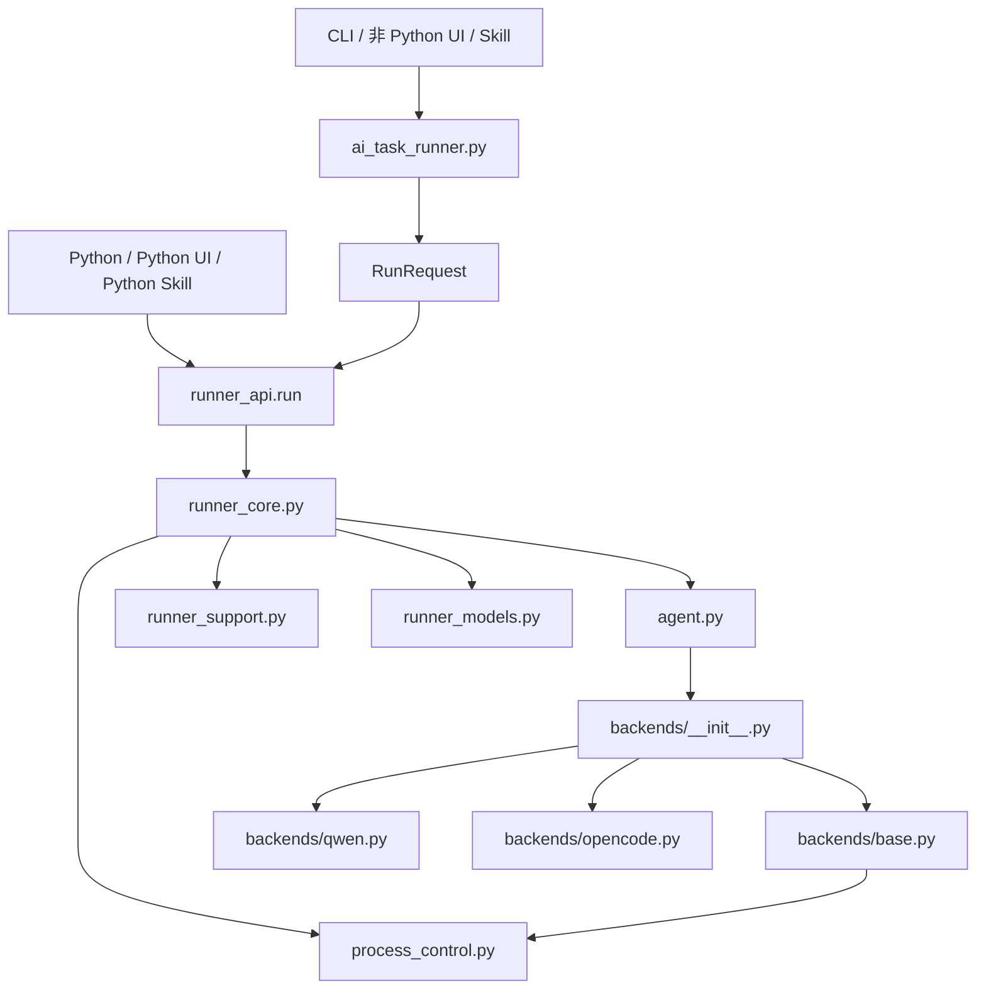
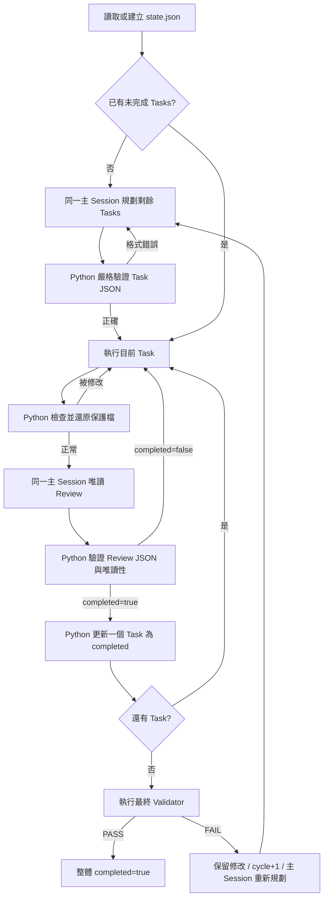

# AI Task Runner 設計與整合指南

> 本文件是 AI Task Runner 的主要設計說明，供人類開發者、維護者、UI 開發者、Skills 作者與後續 AI 共同閱讀。修改核心流程前，應先確認本文件中的不變條件（invariants）。

## 1. 目標與定位

AI Task Runner 是一個小型、可重用、可長時間執行的 AI 任務控制器。它不嘗試取代 Qwen、OpenCode 或未來的 Codex，而是負責控制：

- 任務拆分與順序
- 同一主 Session 的延續
- Task 狀態與持久化
- 模型暫時性錯誤的自動重試
- 每個 Task 的 AI 完成複核
- 最終 Python／AI Validator
- 驗證失敗後的保留修改、重新規劃與修復
- 中斷後 Resume
- YAML 多需求串行
- UI／Skills 的外部呼叫與事件整合

核心理念：

```text
AI 負責理解、實作與語意判斷
Python 負責流程、狀態、格式、安全與硬性驗證
```

## 2. 設計原則

1. **Python 是唯一的狀態擁有者**：AI 不得直接更新 task status、current、cycle 或 completed。
2. **每個 YAML item 只有一個主 Session**：規劃、執行、Review、重新規劃沿用同一 Session。
3. **AI Validator 使用新 Session**：避免執行者直接替自己背書。
4. **先保留修改，再修正**：Validator FAIL 不回滾專案，主 Session 重新拆分剩餘修正工作。
5. **模型暫時異常不終止流程**：非零 exit、格式截斷、空輸出等使用退避重試。
6. **設定錯誤立即停止**：command、路徑、YAML 格式錯誤不做無意義重試。
7. **小模型友善**：Prompt 短、欄位固定、只傳必要 task context，禁止提問與編造。
8. **不過度抽象**：Backend 可插拔，但 TaskRunner、Validator、YAML 不使用大型 Workflow Framework。
9. **所有整合共用同一入口**：CLI、Python、UI 與 Skills 最終都呼叫 `runner_api.run()`；UI callback 失敗時 Runner 仍繼續執行。

## 3. 專案結構

```text
ai-task-runner/
├── ai_task_runner.py       薄 CLI adapter
├── runner_api.py           唯一正式公開執行入口與 RunRequest
├── runner_core.py          TaskRunner、YAML、Validator 閉環
├── runner_support.py       Prompt、JSON 驗證、唯讀保護、UI、Retry
├── runner_models.py        Task / RunState 持久化模型
├── process_control.py      跨平台 timeout 與程序樹終止
├── version.py              API 與事件共用版本號
├── agent.py                AgentClient：Session-aware AgentBackend facade
├── errors.py               共用錯誤型別
├── backends/
│   ├── base.py             AgentBackend interface 與 CLI 共用執行
│   ├── qwen.py             Qwen 命令、輸出、Session 解析
│   ├── opencode.py         OpenCode 命令、輸出、Session 解析
│   └── __init__.py         AgentBackend registry / factory
├── docs/
│   ├── DESIGN.md           本文件
│   ├── USER_GUIDE.md       完整使用手冊
│   └── TEST_MATRIX.md      異常測試矩陣
├── examples/               可執行案例
└── tests/                  單元、整合、容錯與範例測試
```

### 3.1 命名與相容性

正式名稱：`runner_api.RunRequest`、`runner_api.run()`、`RunState`、`AgentClient`、`AgentBackend`。舊名稱 `api`、`models`、`State`、`Agent`、`Backend` 為薄相容匯出，皆指向同一個物件，不含重複邏輯。`state.json` 欄位與舊版完全相同。

### 3.2 相依方向



重要規則：

- AgentBackend 不可 import `runner_core.py`。
- `runner_support.py` 不可依賴特定 Backend。
- 新增 AgentBackend 不應修改 TaskRunner 流程。
- UI／Skills 應呼叫 `runner_api.run()`；非 Python 整合使用薄 CLI adapter 與 JSON events。不得直接呼叫 `runner_core` 或修改 state。

## 4. 單一需求完整流程



## 5. 每個 Task 完成判定

每個 Task 不會因 AI 回覆「完成」就直接通過。

### 5.1 執行階段

Python 先增加 `attempts`，AI 只收到：

```json
{
  "title": "...",
  "description": "...",
  "acceptance_criteria": ["..."]
}
```

AI 執行完成後，Python：

- 儲存有上限的 `last_output`
- 檢查 state、Runner、Validator、Backend 規則與額外 protect files
- 若保護檔被改動，還原並重做目前 Task

### 5.2 Review 階段

同一主 Session 進行唯讀 Review，必須回傳：

```json
{
  "completed": true,
  "reason": "All acceptance criteria are satisfied.",
  "missing_items": []
}
```

Python 硬性檢查：

- `completed` 必須是 boolean
- `reason` 必須是非空字串
- `missing_items` 必須是字串陣列
- Review 不得修改 tracked source/config files
- 只有 `completed=true` 時，Python 才更新 `status` 與 `current`

### 5.3 Task 狀態權限

```text
AI：不能寫 task status
Python：唯一可寫 status/current/cycle/completed 的角色
```

目前 Task status 使用：

- `pending`
- `completed`

畫面的 `[>]` 由 `state.current` 推導，不需要額外持久化 `running`。

## 6. Validator

### 6.1 Python Validator

Runner 呼叫：

```text
python validator.py --project-root <root> --state-file <state.json>
```

- Exit code `0`：PASS
- 其他：FAIL
- 可加 `--validator-arg`
- 有獨立 timeout，預設 600 秒
- timeout 會終止 Validator 與正常子程序樹，保留 partial output
- Validator 不得修改保護檔；若 timeout 同時修改保護檔，兩種診斷都會保存

適合：編譯、測試、格式、檔案比對、行數、Schema、輸出結果等硬性條件。

### 6.2 AI Validator

- 使用全新 Session
- 只讀檢查目前專案
- 回傳 `passed / reason / missing_items`
- 若修改 tracked source/config，Python 還原並重試
- FAIL 後將結果交給主 Session 重新拆分

重要任務建議優先使用 Python Validator；AI Validator 適合語意、完整性、文件品質與難以程式化的檢查。

## 7. Retry、恢復與自動修復

### 7.1 模型呼叫異常

下列錯誤視為可恢復：

- CLI 非零退出
- 暫時性服務／網路錯誤
- 空輸出或截斷輸出
- JSON 無法解析
- Task／Review／Validator Schema 不合格
- 保護檔或唯讀階段發生非法修改
- 單次 Agent CLI 超過 `agent_timeout`

退避策略：

```text
5s → 10s → 20s → 40s → ... → 最大 300s
```

可由 `--retry-wait` 與 `--retry-max-wait` 調整。

### 7.2 Session 失效

一般錯誤沿用原 Session。只有明確包含下列語意時才清除 Session：

- session not found
- session expired
- invalid session
- cannot / failed to resume session
- unknown session

新 Session 由正常 Prompt 承接：goal、已完成 task、目前 task、validator feedback 與現有專案檔案。

### 7.3 無進度空轉

若連續三次：

- 專案 fingerprint 相同
- Review `missing_items` 相同

下一次執行 Prompt 會要求重新檢查假設並改變方法，但不會跳過或停止 Task。

### 7.4 Validator FAIL 自動修復

```text
Validator FAIL
→ 保留專案修改
→ validator output 寫入 state
→ cycle + 1
→ 同一主 Session 重新規劃剩餘修正
→ 再執行與驗證
```

## 8. 24 小時無人值守能力

### 8.1 Runner 已具備

- 單次 Agent CLI timeout，預設 7200 秒；`0` 表示不限制
- Planning／Re-plan CLI timeout 獨立預設 120 秒；`0` 表示不限制
- Qwen Planning timeout 或 loop detection 會退回通用 Task，避免 24h 執行卡在規劃階段
- 如果 goal 已列出編號 deliverables，fallback planning 會保留為有序 task，不會把整輪壓成單一大 task
- Windows 使用 `taskkill /T /F`，POSIX 使用 process group 終止
- timeout 後不把 Task 標記完成，並進入既有退避 Retry
- 模型非零退出、空輸出、破損 JSON、Schema 錯誤自動 Retry
- Execution／Review／AI Validator 連續模型錯誤會保存診斷並回到 Task／Validator 流程換策略
- 明確 Session 失效後重建，承接 Goal、Task 與 Validator feedback
- Task Review 未完成自動重做
- Validator FAIL 保留修改並重新規劃修復
- Validator 連續同診斷失敗會累計 `validator_failure_count`，下一輪 execution 進入 repair mode
- State 持久化 `stage`、`stage_started_at`、`last_activity_at` 與 `last_error`，供長時間監控與 Resume 判斷
- Python Validator timeout 會終止正常子程序樹並保留 partial output
- `max_attempts=0`、`max_cycles=0` 可持續執行，不設邏輯上限
- YAML item 各自持久化 state/session
- Atomic state write、Resume 與損毀 State fail-fast
- 無進度策略變更
- 輸出長度限制、暫存與舊備份清理
- UI callback 與 JSON consumer disconnect 隔離

### 8.2 v1.1.1 初始化與 Resume 強化

- Resume 可省略 Goal，從 state 載入原需求
- State 不存在、JSON 損毀、current/status/cycle 非法或 project root 不一致時提供明確錯誤
- command 不存在時不建立新的 state
- `--force-new` 初始化失敗時保留原 state

### 8.3 仍需外部環境負責

Runner **不能無條件保證任務一定完成**。以下需要 supervisor 或外部基礎設施：

1. Python process 被 OS、使用者或 OOM 終止
2. 主機重新啟動
3. 磁碟空間耗盡、權限或檔案系統失效
4. CLI 建立完全脫離原程序樹的 daemon
5. Qwen／OpenCode 版本改變參數或輸出格式
6. Goal／Validator 條件不可達成或模型始終無法收斂

正式 24h 使用建議：

- Windows：Task Scheduler、NSSM 或服務包裝器，以相同參數加 `--resume` 重啟
- Linux：systemd `Restart=always`，重啟命令固定使用 `--resume`
- UI：Runner 放在 worker subprocess，不在 GUI 主執行緒直接執行
- 監控磁碟、state 的 `current/cycle/attempts` 與程序存活

可提供的保證：

```text
只要 Runner process 與外部環境仍可運作，可恢復異常會 Retry／Repair；
Final Validator 未 PASS 時，Python 不會把整體誤標為 completed。
```

## 9. 唯讀與檔案保護

### 9.1 保護檔

預設保護：

- `state.json`
- Runner 原始碼（包含 `runner_api.py`）
- Validator
- Backend 專屬規則檔
- `--protect-file` 指定檔案

被修改時 Python 會還原並 retry。

### 9.2 Review／AI Validator 唯讀

Runner 建立暫存專案副本，比對前後 manifest，還原 source/config 變更。

預設排除可重建目錄：

```text
.git .ai-task-runner .idea .venv .vs __pycache__
bin build coverage dist node_modules obj target
```

排除目錄中的變更視為測試／建置 artifact，不還原。

此機制不是 OS sandbox。執行階段對專案外寫入仍主要依靠 Prompt／Backend 規則，因此高風險環境仍應使用 OS 權限、容器或 VM。

## 10. YAML 批次

```yaml
- prompt: 完成功能 A
  validator: validators/a.py

- prompt: 完成功能 B
  validator: ai
  validator_prompt: 必須檢查文件與相容性
```

規則：

- 順序執行
- 前一項 PASS 才開始下一項
- 不同 item 使用不同主 Session
- 每個 item 內使用同一主 Session
- `--resume` 跳過已完成 item，續跑未完成 item
- state 路徑：`.ai-task-runner/script/001/state.json`

## 11. Backend 擴充介面

Backend 只負責：

```python
class AgentBackend(ABC):
    name: str
    default_command: str

    def build_command(self, prompt: str, session_id: str) -> list[str]: ...
    def decode(self, raw: str) -> BackendResult: ...
```

新增 Codex：

1. 建立 `backends/codex.py`
2. 實作 command 與 output/session decode
3. 在 `backends/__init__.py` 註冊
4. 新增 backend fixture tests

不需要修改 TaskRunner、Validator、YAML、State 或 Prompt。

## 12. UI／Skills／外部系統整合

### 12.1 唯一公開入口

所有執行表面最終都使用：

```python
from runner_api import RunRequest, run

result = run(request, on_event=handler)
```

`RunRequest` 是 CLI、Python、UI 與 Skills 共用的 canonical request model。`run()` 是唯一公開執行入口，負責選擇單一需求或 YAML script，再交給同一個核心流程。

```text
CLI flags ─┐
Python ────┼─> RunRequest ─> runner_api.run() ─> TaskRunner
UI ────────┤
Skill ─────┘
```

不變條件：

- CLI 不可自行呼叫 `execute()` 或 `execute_script()`。
- UI／Skill 不可複製 TaskRunner 邏輯。
- 第三方不可直接修改 state。
- 新增整合方式時，只需建立 `RunRequest`、呼叫 `run()`、接收 event。

### 12.2 Python、Python UI 與 Python Skill

```python
from runner_api import RunRequest, run


def on_event(event: dict) -> None:
    print(event["type"], event.get("status"))


result = run(
    RunRequest(
        backend="qwen",
        command="qwen.cmd",
        project_root=r"C:\work\project",
        goal="完成指定功能並補齊測試",
        validator="ai",
    ),
    on_event=on_event,
)
```

JSON-like request 也使用同一入口：

```python
result = run({
    "backend": "opencode",
    "project_root": "/work/project",
    "goal": "完成需求",
    "validator": "ai",
})
```

API 特性：

- 不需要 `argparse.Namespace`
- 預設不輸出終端 UI
- callback 接收與 JSONL 相同的事件
- callback 發生例外不會中止 Runner
- 回傳 `RunResult(exit_code, state_files, states)`
- `RunConfig` 保留為 `RunRequest` 的相容 alias
- API 是同步呼叫；GUI 應放入 worker thread 或獨立 subprocess

### 12.3 CLI、非 Python UI 與 Skills

```bash
python ai_task_runner.py \
  --backend qwen \
  --project-root /work/project \
  --goal "完成需求" \
  --validator ai \
  --json-events
```

`ai_task_runner.py` 只做兩件事：

1. 將 CLI flags 轉成 `RunRequest`
2. 呼叫 `runner_api.run()`

因此 CLI 與 Python API 不存在兩套流程。

`--json-events` 時 stdout 每行都是獨立 JSON：

```json
{
  "schema_version": 1,
  "type": "runner.status",
  "run_id": "...",
  "cycle": 1,
  "current": 0,
  "status": "AI 正在處理目前任務",
  "tasks": []
}
```

事件類型：

- `runner.progress`
- `runner.status`
- `runner.error`
- `runner.stopped`
- `script.item_started`
- `script.item_completed`
- `script.item_failed`

UI 可在背景 subprocess 逐行解析事件。需要停止時終止 subprocess；下次使用相同 request 並設定 `resume=true`，或 CLI 加 `--resume`。

### 12.4 State polling

外部系統也可唯讀：

```text
.ai-task-runner/state.json
.ai-task-runner/script/*/state.json
```

State 使用 atomic replace 寫入，適合 UI 定期輪詢。事件流是主要整合方式，state polling 適合重新連線、查詢歷史或程序重啟後恢復畫面。

### 12.5 第三方開發規則

UI／Skill／CI adapter 應保持薄層：

```text
收集輸入
→ 建立 RunRequest
→ 呼叫 run()
→ 顯示事件與 RunResult
```

不應：

- import `runner_core.TaskRunner` 後自行控制流程
- 自行更新 `State`／Task status
- 重新實作 retry、resume 或 validator cycle
- 分別為 Qwen／OpenCode 寫不同 UI 流程

這確保新增 Web UI、桌面 UI、Skill、CI plugin 或 HTTP wrapper 時，不需要修改本專案核心。

## 13. State 格式

主要欄位：

```json
{
  "run_id": "...",
  "goal": "...",
  "project_root": "...",
  "cycle": 1,
  "current": 0,
  "tasks": [],
  "validator_output": "",
  "completed": false,
  "agent_session_id": "..."
}
```

Task 欄位：

```json
{
  "id": "c01-t001",
  "title": "...",
  "description": "...",
  "acceptance_criteria": ["..."],
  "status": "pending",
  "attempts": 0,
  "last_output": "",
  "last_review": null,
  "progress_key": "",
  "stagnant_attempts": 0
}
```

相容規則：新增持久化欄位時應提供預設值，避免舊 state 無法 Resume。

## 14. Prompt 設計

### 14.1 小模型友善策略

- 一個 Prompt 只處理一個階段
- JSON Shape 固定且有正確範例
- Task 只傳 title/description/acceptance criteria
- 已完成工作只傳 title
- Validator feedback 截斷
- 禁止提問、等待與編造
- 模糊處採最安全可實作假設
- 規劃或修改前檢查相關結構、入口、相依、公開介面、慣例與測試
- 優先採用完整滿足 Task 的最小且可維護修改
- 預設保留既有行為、公開介面、檔案格式與相依
- 避免無關重構、重複實作、推測性功能與不必要套件
- Schema 錯誤由 Python retry，不依賴模型自律

### 14.2 Prompt 不變條件

修改 Prompt 時不得移除：

- 只執行目前 Task
- 不得修改 Runner state
- 不得提問或等待
- 不得編造證據
- Review／AI Validator 唯讀
- 固定 JSON output shape
- 規劃前理解相關專案結構與既有測試
- 實作採最小、可維護且相容的修改
- Review 檢查範圍、可維護性與相關既有行為

## 15. 測試策略與目前結果

v1.1.1 以六類測試驗證：

1. **核心閉環**：Session、Task、Review、Validator、Re-plan、Resume
2. **Backend**：Registry、Qwen/OpenCode command/session parsing、空輸出
3. **Integration**：Python API、CLI、JSONL events、callback isolation、YAML
4. **相容性**：舊 import alias、舊 State、同一 process 多工作
5. **Examples**：範例結構、路徑、Validator 與 Python compile
6. **24h 韌性**：四階段 timeout、程序樹、State 損毀、限制與異常診斷

目前共有 **95 tests passed / 1 skipped**，以隔離群組執行：

- Backend：9
- Examples：5
- API／CLI／Events：14
- Public contract：6
- Core Runner：30
- Resilience matrix：27 passed / 1 skipped
- Documentation contract：4

重點新增驗證：

- Qwen Planning timeout 後 fallback；Execution、Review、AI Validator 各 timeout 一次後全部恢復
- Planner 回傳多個 Task 時，Runner 依序 execute/review 每一項後才進 final validator
- Validator 連續同錯誤後進入 repair mode 並收斂
- 多輪 validator cycle soak 測試完成且 state 保持有界
- POSIX process group 實際終止正常 child tree
- detached child 持有 stdout 時，Runner 不永久卡在 `communicate()`
- Windows `taskkill /PID /T /F` 參數與 timeout 單元測試
- Python Validator timeout 終止子程序、保留 partial output、還原 protected file
- command 驗證失敗不留下 state
- Force New 初始化失敗保留舊 state
- Resume 無 Goal、State 缺失／損毀／跨 project root
- 1000 次暫時失敗確認 Retry 使用迴圈而非遞迴
- max attempts／cycles 停止碼與 0 不限制行為
- 唯讀階段修改、新增、刪除、rename 全部還原

完整矩陣與外部 soak test 邊界見 [`TEST_MATRIX.md`](TEST_MATRIX.md)。

仍不能由單元／短整合測試完全證明：

- 真實 Qwen／OpenCode 在目標 Windows 主機連續運行 12–24 小時
- 主機重開後 supervisor 的實際 Resume
- OOM、磁碟滿與未來 CLI 版本變更
- 不可行需求是否能由模型收斂

## 16. 維護者／AI 修改清單

修改後至少確認：

1. `python -m py_compile *.py backends/*.py`
2. 全部 tests 分組通過
3. CLI 參數與預設值未意外改變
4. State 舊格式仍可 load
5. Qwen/OpenCode Session 行為未改變
6. `RunRequest` 是唯一 request model，CLI 必須委派給 `runner_api.run()`
7. JSON event `schema_version` 不隨意變更
8. 新 Backend 不污染 runner_core
9. Prompt 仍適合小模型
10. 文件與 examples 同步更新

## 17. 非目標

本專案刻意不提供：

- 多 Agent 投票／共識
- DAG Workflow Engine
- 自動 Git commit/rollback
- Web Server 或資料庫
- 模型自動切換與成本路由
- OS 級 Sandbox
- 內建程序監督服務

這些功能可由外部 UI、Skills、CI 或 supervisor 包裝，不應塞入核心。

## 18. 成熟度結論

- 架構：責任清楚、Backend 可擴充、核心無特定模型依賴
- 維護性：模組數量適中，沒有過度拆分
- 小模型：Prompt 與 Schema 已針對小模型收斂
- 自動修復：Task retry、Validator re-plan、Session recovery 與 stagnation strategy 已形成閉環
- 24h：Runner process 存活時具備長時間自動 retry／repair；process／主機失效需 supervisor 加 `--resume`
- UI／Skills：已提供 CLI、JSONL event stream、Python API 與 state polling，不需修改核心

正式導入前仍建議至少做一次真實 12–24 小時 soak test，以確認實際模型版本、專案大小、磁碟空間與 CLI 行為。

## 19. v1.1.1 完整審查紀錄（2026-07-25）

本次重新檢查正式程式、異常流程、測試與文件，確認：

- 對外只有 `runner_api.run(RunRequest(...), on_event=...)` 一個執行入口
- CLI、Python、UI、Skills 共用相同 request、timeout、retry 與 validator 流程
- `process_control.py` 統一 Agent 與 Python Validator 的程序樹終止
- timeout 後的 output drain 有第二層上限，不會因 descendant 持有 pipe 永久等待
- Resume 不再錯誤要求 Goal，並驗證 State 完整性與 project root
- command fail-fast 不會留下新 state；Force New setup failure 不破壞舊 state
- Python Validator timeout 可同時回報 timeout、partial output 與 protected-file restoration
- 87 項測試分組通過；Python compile 通過
- README、USER_GUIDE、DESIGN、TEST_MATRIX 均對齊 v1.1.1

目前應凍結核心架構。後續優先做目標 Windows 主機的 Qwen／OpenCode 12–24 小時 soak test，以及 Task Scheduler／NSSM Resume 驗證；不建議加入 Workflow Framework、DI Container 或 Event Bus。
