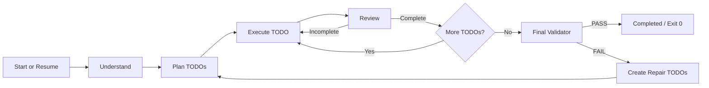
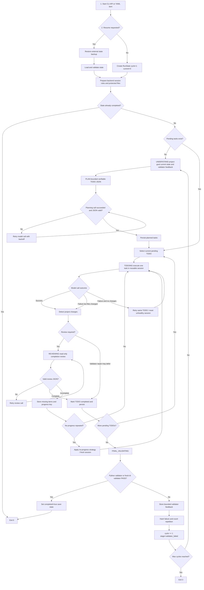
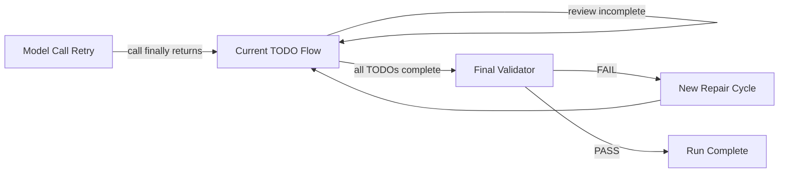
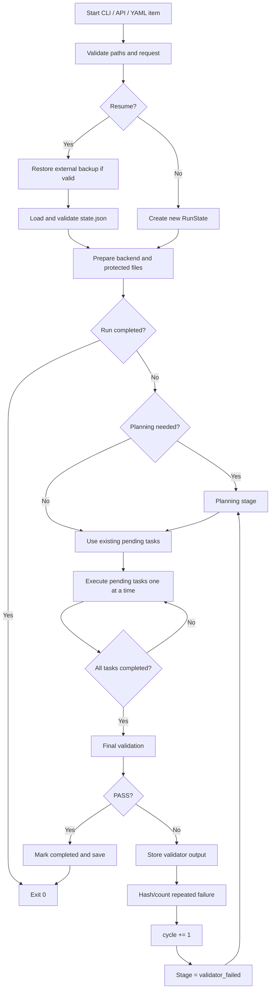
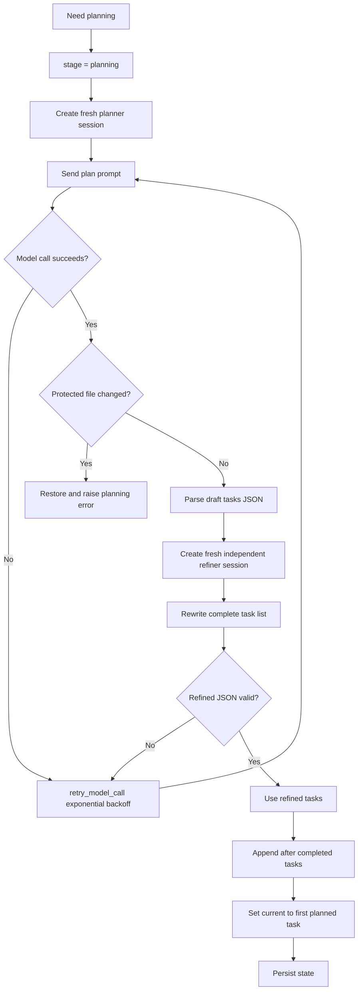
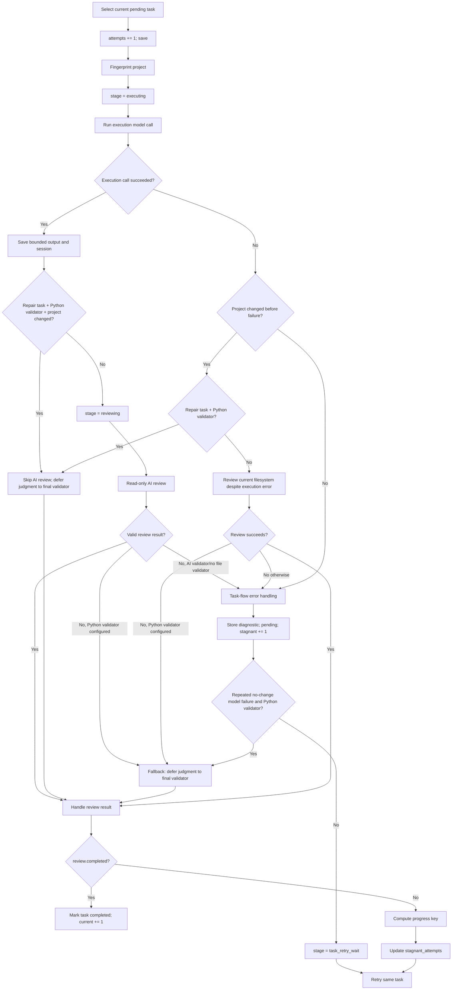
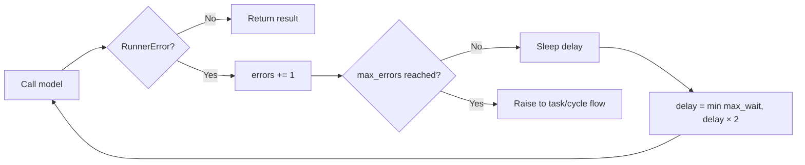
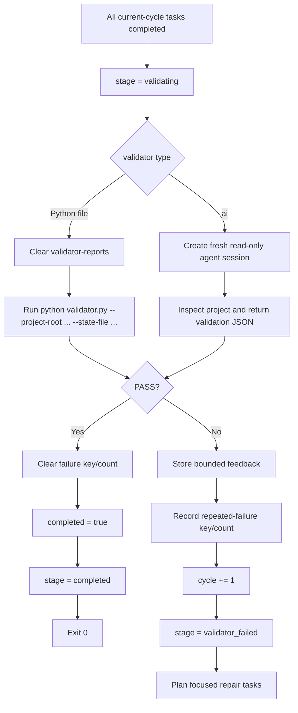
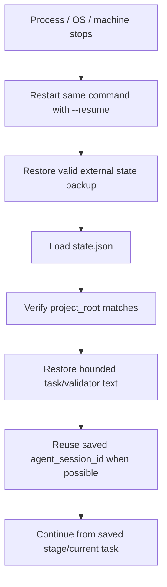

# AI Task Runner Design v1.1.1

> Traditional Chinese version: [`DESIGN.zh-TW.md`](DESIGN.zh-TW.md).

## 1. Purpose

AI Task Runner is a small, task-agnostic orchestration layer around coding-agent CLIs. The agent owns project implementation; **the runner owns orchestration**, persistence, retry, review, validation, protection, and resume.

The design goal is not to understand or implement one business domain in Python. The runner only provides a generic closed loop that can keep a coding task moving for long unattended runs:

1. understand the goal and split it into TODO tasks;
2. execute exactly one current task;
3. review the current filesystem state without allowing review-time edits;
4. retry incomplete or failed work;
5. run an authoritative final validator;
6. convert validator failures into repair tasks;
7. persist enough state to resume after process or machine interruption.

A run is complete only when **Final Validator PASS** is recorded. A model claiming that work is finished is never sufficient by itself.

---

## 2. Complete Flow at a Glance

### 2.1 Simple end-to-end flow

This is the shortest accurate representation of one run:

```text
Start / Resume
  -> Understand project and requirement
  -> Plan verifiable TODO tasks
  -> Execute current TODO
  -> Review current filesystem result
       -> incomplete / failed: retry the same TODO
       -> complete: mark TODO completed and continue
  -> All TODOs completed
  -> Run final Python or AI validator
       -> PASS: save completed state and exit 0
       -> FAIL: convert feedback into repair TODOs, increment cycle, and continue
```



The important rule is: **execution or review success does not finish a run**. Only the authoritative final validator can mark the run completed.

### 2.2 Detailed single-line stage sequence

The normal stage order is:

```text
startup
-> state_restore / state_create
-> backend_prepare
-> understanding
-> planning
-> todoing
-> reviewing
-> todo_completed
-> next todoing/reviewing pair
-> final_validating
-> completed
```

When validation fails, the line continues as a new repair cycle:

```text
final_validating
-> validator_failed
-> cycle increment
-> repair_understanding / repair_planning
-> repair todoing
-> reviewing or validator-deferred completion
-> final_validating
-> completed or another repair cycle
```

A practical expanded flow is:



### 2.3 The three retry loops

The runner has three separate retry scopes. They must not be confused:

| Retry scope | Trigger | What is repeated | State/session behavior | Stop condition |
|---|---|---|---|---|
| Model-call retry | CLI error, timeout, loop detection, invalid structured output, temporary session failure | One planning, execution, review, or AI-validation call | Exponential backoff; unhealthy sessions may be replaced | Call succeeds or retry policy escalates to its parent flow |
| TODO retry | Review says incomplete, execution made no usable progress, protected files were edited, or a recoverable call failed | The same current TODO | Attempts and progress fingerprint are persisted; repeated stagnation can force a fresh session | TODO is completed/deferred, or `max_attempts` returns exit 2 |
| Validator-cycle retry | Final Python/AI validator returns failure | A new repair planning and TODO cycle | Validator output is persisted; repeated identical failures can reset the main session | Validator passes, or `max_cycles` returns exit 3 |



### 2.4 Understand and plan are logical stages

`understand` means gathering enough current evidence to plan correctly: the goal, project structure, existing files, previous task output, and validator feedback. Depending on backend behavior, understanding may be represented inside the planning prompt rather than by a permanently separate source-code function. It is still a distinct logical stage in the task flow and logs.

`plan` creates a draft of bounded TODO records. A second, independent fresh-session refiner rewrites the draft rather than defending it, removes process-only tasks, and splits independently verifiable deliverables. Planning is read-only. If either call cannot produce valid task JSON, the runner retries the complete planning flow with compact feedback. Python does not split user prompts by Markdown, numbering, paragraphs, punctuation, or language-specific keywords.

---

## 3. Responsibility Boundary

### Agent responsibilities

The selected backend agent, currently Qwen Code or OpenCode, may:

- inspect the project and requirement;
- propose TODO tasks during planning;
- modify project source, tests, configuration, and documentation during execution;
- inspect validator feedback and repair failures;
- perform a read-only completion review;
- perform a fresh-session read-only AI final validation when `--validator ai` is used.

### Runner responsibilities

Python code owns all generic control behavior:

- CLI, Python API, and YAML batch entry points;
- state-machine transitions;
- task indexing and completion status;
- model-call retry with exponential backoff;
- task retry and no-progress detection;
- validator-cycle retry;
- session reuse and unhealthy-session reset;
- protected-file snapshots and restoration;
- read-only planning, review, and AI validation;
- project-change detection;
- subprocess timeout and process-tree termination;
- activity watchdog behavior;
- atomic state persistence and resume;
- bounded model and validator feedback;
- UI, log, JSON events, and exit codes.

The runner must remain task-agnostic. It may contain generic orchestration rules and AI prompt guidance, but Python must not split or classify user goals by Markdown, numbering, punctuation, natural-language keywords, or project-specific terms.

---

## 4. Main Entry Points

All entry points converge on the same `TaskRunner` state machine.

```text
CLI: ai_task_runner.py
        |
Python API: from runner import RunRequest, run
        |
YAML script: --script tasks.yaml
        v
runner/core.py -> TaskRunner.run()
```

The canonical API is:

```python
from runner import RunRequest, run

result = run(
    RunRequest(
        goal="Build X",
        project_root=".",
        validator="validator.py",
    )
)
```

YAML batch mode creates one independent child run per item. Each child has its own work directory and state file under:

```text
.ai-task-runner/script/001/state.json
.ai-task-runner/script/002/state.json
...
```

The batch stops at the first non-zero child exit code. Re-running the same script with `--resume` resumes items whose state files exist and starts new items fresh.

---

## 5. Core Modules

```text
ai_task_runner.py          CLI parser and main entry
runner/api.py              Public RunRequest/run API and validation
runner/core.py             TaskRunner state machine and orchestration
runner/models.py           Persisted RunState and Task models
runner/defaults.py         Shared default backend, timeout, and limit values
runner/prompting.py        Markdown prompt-template loading and builders
runner/validation.py       Fresh-session AI final validator
runner/script_runner.py    YAML batch orchestration and item resume setup
runner/support.py          Retry, parsing, protection, fingerprint, validator helpers
runner/process_control.py  Subprocess I/O, timeout, watchdog, process-tree kill
runner/agent.py            Session-aware backend facade
runner/agent_args.py       Backend-specific planning/runtime arguments
runner/ui.py               Human UI, log file, and JSON events
runner/errors.py           RunnerError contract
runner/backends/base.py    Backend interface
runner/backends/qwen.py    Qwen stream-json command and error parsing
runner/backends/opencode.py OpenCode command and result parsing
prompts/                   Editable task-agnostic prompt templates
```

Dependencies are intentionally one-way: `core.py` calls planning, prompting, validation, support, UI, and backend helpers; those modules do not import `core.py` to drive orchestration themselves.

---

## 6. Persisted State Model

The main state file is:

```text
<project-root>/.ai-task-runner/state.json
```

A second backup copy is written outside the project under the system temporary directory. Its location is derived from a hash of the work-directory path. On `--resume`, the backup is copied back first when valid. This provides recovery when the in-project state file was lost or damaged while the external backup survived.

### RunState fields

| Field | Meaning |
|---|---|
| `run_id` | Stable identifier for one run |
| `goal` | Original persisted requirement |
| `project_root` | Root this state belongs to |
| `cycle` | Final-validation cycle, starting at 1 |
| `current` | Index of the current task |
| `tasks` | Completed and pending task records |
| `validator_output` | Bounded latest final-validator feedback |
| `completed` | True only after final validator PASS |
| `agent_session_id` | Reusable main execution session; Review uses independent sessions |
| `stage` | Current state-machine stage |
| `stage_started_at` | Timestamp when the stage changed |
| `last_activity_at` | Timestamp of the latest stage update |
| `last_error` | Bounded latest stage error/detail |
| `validator_failure_key` | Hash of normalized latest validator failure |
| `validator_failure_count` | Consecutive count of the same failure |

### Task fields

| Field | Meaning |
|---|---|
| `id` | Stable cycle/task identifier |
| `title` | Short TODO title |
| `description` | Work scope |
| `acceptance_criteria` | Verifiable completion conditions |
| `status` | `pending` or `completed` |
| `attempts` | Number of task-flow attempts |
| `last_output` | Bounded previous execution output/diagnostic |
| `last_review` | Latest parsed completion review |
| `progress_key` | Hash of project state plus missing items |
| `stagnant_attempts` | Consecutive attempts with identical progress key |

State is written after every meaningful transition. Writes use a temporary file plus atomic `os.replace`, with short retries for transient Windows locks. Model output retained per task is bounded to 10,000 characters. Validator feedback is bounded to **20,000** characters with beginning and end preserved.

---

## 7. Top-Level Task Flow



`TaskRunner.run()` is a loop over three phases:

```text
plan if needed -> run pending tasks -> validate cycle
```

The loop ends only when:

- final validation passes, returning exit code `0`;
- `--max-attempts` stops a repeatedly retried task, returning `2`;
- `--max-cycles` stops repeated validator cycles, returning `3`;
- an unrecoverable configuration or state error escapes to the CLI error boundary.

Both `--max-attempts` and `--max-cycles` default to `0`, meaning unlimited.

---

## 8. Planning Flow

Planning runs when no pending task remains and either:

- there are no tasks yet; or
- the previous final validator failed and repair tasks must be created.

Planning is read-only with respect to the project. Qwen receives the runner work directory as its planning root and tool access is disabled during planning, so planning must return task JSON instead of editing project files. Other backends may use the project root, but all project changes made during planning are detected and restored.



### Planning retry behavior

The outer model-call retry uses `retry_model_call()` with exponential backoff:

```text
retry_wait, 2×retry_wait, 4×retry_wait, ... capped at retry_max_wait
```

Planning does not set a fixed `max_errors`, so draft or independent-refinement failures retry indefinitely by default. Each retry restarts the complete draft-and-refine flow with compact feedback asking for concrete single-deliverable task JSON. The runner does not derive tasks from the user's prompt structure; only valid refined AI task JSON becomes the persisted TODO list.

---

## 9. Single-Task Execution and Review Flow

The runner executes exactly `tasks[current]`. Before each task-flow attempt it increments `task.attempts` and persists state.



### Why execution failure does not automatically discard work

An agent call can end with timeout, loop detection, session failure, or another backend error after it has already written useful files. Therefore the runner fingerprints the project before execution and compares it afterward.

A task is completed only after the execution call succeeds and the read-only AI review returns `completed=true`. Execution or review failures retry the same task even when files changed; the final validator never substitutes for task review.

This behavior preserves partial progress and avoids repeating identical tool calls against files that may already contain the intended change.

### Review contract

Review is read-only. It returns JSON containing at least:

```json
{
  "completed": true,
  "reason": "...",
  "missing_items": []
}
```

The whole project is copied to a temporary backup before review. Any source changes made by the reviewer are detected, restored, and treated as a review error. Protected files are independently snapshotted and restored as well.

When a Python final validator is configured, malformed or repeatedly failed AI review can be converted to:

```text
completed = true
completed = true only after successful AI review
```

This does not mean the work is accepted. It only advances the TODO so the Python validator can make the authoritative decision after all tasks.

### Validator-repair no-change safeguard

A repair task cannot be marked completed merely because AI review says so when:

- validator feedback is still present;
- the task is a validator-repair task;
- no project file changed;
- completion was not explicitly deferred to the final validator.

The runner rewrites that review to incomplete and requests an actual project change.

---

## 10. Three Retry Layers

The project has three distinct retry levels. They must not be confused.

### 9.1 Model-call retry

`retry_model_call()` retries one logical model operation, such as planning, execution, review, or AI validation.



Defaults:

- `retry_wait = 5` seconds;
- delay doubles after each failure;
- `retry_max_wait = 300` seconds;
- execution allows one model-call error before returning control to task flow;
- review allows one error with a Python validator, or three errors with AI validation;
- planning retries without a fixed model-call limit until valid task JSON is returned.

This layer handles transient backend errors, invalid model JSON wrapped as `RunnerError`, timeout results surfaced by the backend, loop detection, unavailable sessions, and similar call-level failures.

### 9.2 Task-flow retry

Task-flow retry repeats the same TODO from its persisted state. It happens when:

- review says `completed = false`;
- execution fails without usable changed files;
- protected files were modified and restored;
- read-only review fails and cannot be delegated;
- a repair task produced no project change;
- the task remains otherwise unverified.

Before retrying, the runner:

1. keeps the task `pending`;
2. stores bounded output or diagnostics;
3. persists session and task state;
4. optionally sleeps `retry_delay`, default 2 seconds;
5. starts the same task again and increments `attempts`.

`--max-attempts N` limits attempts per task. `0` means unlimited.

### 9.3 Validator-cycle retry

After every TODO is completed or deferred, the final validator runs. On FAIL:

1. validator output is bounded and stored;
2. a normalized SHA-256 failure key is calculated;
3. repeated identical failures increment `validator_failure_count`;
4. `cycle` increments;
5. stage becomes `validator_failed`;
6. planning runs again and creates repair task(s);
7. completed prior tasks remain in state;
8. project changes are kept.

`--max-cycles N` limits final-validation cycles. `0` means unlimited.

When the same validator failure repeats at least twice, repair prompts include a stronger repeated-failure hint and execution clears the agent session before retrying the repair. This preserves runner state and validator evidence while discarding a potentially stuck model conversation.

---

## 11. No-Progress Detection and Session Reset

A task review that reports missing items produces a `progress_key` from:

```text
SHA-256(project fingerprint + ordered missing_items)
```

If the key is unchanged across attempts, `stagnant_attempts` increases. If project files or missing items change, the counter resets to 1 for the new key.

`NO_PROGRESS_LIMIT` is 3. At or above this limit:

- execution clears the main agent session before the next attempt;
- the prompt receives a no-progress recovery strategy;
- if execution model calls repeatedly fail without project changes and a Python validator exists, the runner may defer the task to final validation instead of looping forever on that model stage.

Clearing a session does not lose the task. The new session receives the original goal, completed task titles, current task, validator feedback, previous diagnostics, and persisted filesystem state.

---

## 12. Final Validation Flow



### Python validator

Python validators run as:

```text
python validator.py --project-root <root> --state-file <state.json> [validator args]
```

Contract:

- exit code `0` means PASS;
- any non-zero exit code means FAIL;
- stdout and stderr are combined;
- no stdout schema is required;
- timeout is a validator failure;
- protected-file changes during validation are restored and cause FAIL.

The default validator timeout is 1200 seconds. Before each run, `.ai-task-runner/validator-reports/` is cleared so stale evidence cannot be mistaken for the current failure. Detailed evidence should be written there while stdout remains a compact actionable summary.

External commands such as exe, bat, jar, or Java tools should use `docs/validator_templates/external_command_validator.py`. It preserves the Python validator contract, stores command output, and copies configured log folders under `.ai-task-runner/validator-reports/external-command/`.

### AI validator

With `--validator ai`, validation uses a new session and a read-only project call. It returns:

- `passed`;
- `reason`;
- `missing_items`;
- `checks_run`;
- `suggested_checks`.

On failure, missing items are formatted into structured validator feedback for the next repair-planning cycle. A deterministic Python validator is still the stronger completion contract.

---

## 13. Process Control and Watchdogs

Every AI CLI and validator subprocess is launched through `process_control.py`.

### Hard timeout

- execution default: `--agent-timeout 7200`;
- planning/review default: `--planning-timeout 600`;
- validator default: `--validator-timeout 1200`.

A hard timeout kills the process tree. On Windows the runner uses `taskkill /PID <pid> /T /F`; on Unix-like systems it starts a new process session and kills the process group.

### Activity idle watchdog

Model calls also use `--agent-idle-after-change-timeout`, default 900 seconds. During execution, activity is refreshed by:

- new CLI stdout; or
- a detected project filesystem change.

After the first project file change in an execution model call, only new project changes refresh the idle timer. Read-only planning, review, and AI-validation calls use the same setting to retry calls that produce no CLI output. If no qualifying activity happens before the idle timeout, the process tree is stopped. The resulting error then enters the normal retry or changed-files decision flow:

- files changed: review the current state or defer repair judgment to the Python validator;
- no files changed: retry the task.

The watchdog never marks work complete on its own.

### Protected-file early detection

During execution, each watchdog poll also checks protected-file snapshots. If a protected file changed, the call fails quickly, and the `finally` path restores the original bytes.

---

## 14. File Protection and Read-Only Operations

Protected files include:

- the goal file, when `--goal-file` is used;
- the Python validator file;
- `.ai-task-runner/state.json`;
- runner source files;
- backend rule files prepared by the agent facade;
- every user-supplied `--protect-file` path.

`protected_ask()` snapshots bytes and hashes before execution and restores every changed protected file afterward, even when the model call throws.

Planning, review, and AI validation add a stronger project-wide read-only layer:

1. build a manifest of files, directories, symlinks, and hashes;
2. copy the project to a temporary backup, excluding build/cache directories and the runner work directory;
3. perform the model operation;
4. compare before/after manifests;
5. restore every detected source change;
6. return the changed-path list so the caller can treat edits as an error or informational event.

Excluded cache/build directories include common paths such as `.git`, `.venv`, `node_modules`, `bin`, `obj`, `target`, `dist`, and `__pycache__`.

---

## 15. Resume Semantics

Resume is state-based, not prompt-history-based.



Resume does not require repeating `--goal`; the original goal is already in state. The filesystem remains the source of implementation truth. The persisted session ID is reused when the backend supports it, but the runner can clear the session after no-progress or repeated validator failures and continue with the same saved task state.

The runner itself cannot restart after its Python process, operating system, machine, or power is terminated. A service manager, scheduled task, CI agent, or other external supervisor must restart the command with `--resume`.

---

## 16. Prompt Design

Prompt text lives under `prompts/`, not embedded as large domain-specific strings in Python.

### Planning prompt receives

- original goal;
- project location and inspection rules;
- protected-file boundaries;
- previous validator feedback when repairing;
- task JSON schema and right-sizing rules.

### Execution prompt receives

- hard runner rules;
- original goal;
- completed task titles;
- current task only;
- acceptance criteria;
- previous attempt output or diagnostic;
- current validator feedback;
- no-progress or repeated-validator-failure recovery hints;
- validator path when available.

### Review prompt receives

- current task;
- current filesystem state;
- execution output/diagnostic;
- completion JSON contract;
- read-only instruction.

Execution prompts explicitly tell the agent to work only on the current task. The runner does not replay every historical output, which keeps context bounded for local models.

---

## 17. Stage Values

The important persisted stages are:

| Stage | Meaning |
|---|---|
| `created` | New state exists, planning has not started |
| `planning` | Deriving initial or repair tasks |
| `executing` | Agent may modify project files for current task |
| `reviewing` | Read-only completion judgment |
| `task_retry_wait` | Task-flow error recorded before retry |
| `validating` | Running Python or AI final validator |
| `validator_failed` | Final validation failed; repair planning required |
| `completed` | Final validator passed |

`stage_started_at`, `last_activity_at`, and `last_error` make state and JSON-line logs useful to an external UI or supervisor.

---

## 18. Exit Codes

| Code | Meaning |
|---:|---|
| `0` | Final validator passed, or `--plan-only` completed planning |
| `2` | Current task reached `--max-attempts` |
| `3` | Run exceeded `--max-cycles` after validator failures |
| other non-zero | CLI/configuration/unhandled runner error boundary |

A YAML script returns the first failing item's code.

---

## 19. Backend Rule Files

- Qwen Code: `QWEN.md`
- OpenCode: `AGENTS.md`

OpenCode's official project rule filename is `AGENTS.md`, not `AGENT.md`.

Backend-specific command construction and output/error parsing stay under `runner/backends/`. Backend-specific planning/runtime argument policy stays in `runner/agent_args.py`. The core state machine does not parse Qwen or OpenCode output directly.

---

## 20. Important Design Guarantees and Limits

### Guarantees provided by the runner

- one persisted current task at a time;
- project changes are not discarded merely because the model call exits with an error;
- protected files are restored;
- planning/review/AI validation project edits are restored;
- transient model calls retry with bounded exponential delay;
- incomplete tasks retry from persisted state;
- validator failures create new repair cycles without reverting project work;
- repeated no-progress can reset the model session;
- state is atomically written to project and external backup locations;
- final completion requires validator PASS.

### Limits

- the runner cannot guarantee business correctness beyond the validator contract;
- unlimited attempts/cycles can run indefinitely when the goal or validator is impossible;
- AI review and AI validation remain probabilistic;
- project fingerprinting ignores configured cache/build directories and therefore is not a full version-control diff;
- external restart is required after Python/OS/machine termination;
- session recovery depends on backend support, so persisted filesystem and runner state remain authoritative.

---

## 21. Testing the Design

The repository includes unit, integration, public-contract, architecture, backend, documentation, external-validator, and resilience-matrix tests under `tests/`.

Run:

```bat
python -m pytest -q
```

The resilience tests cover important branches such as timeout after project changes, review timeout, session expiration, flaky calls, protected-file restoration, no-progress handling, validator repair, resume, YAML item state isolation, and process-control behavior.

## Review error tolerance

`--review-error-retries N` controls only Review infrastructure/format errors. Each Review attempt uses a fresh independent session; every error increments persisted audit counters. Review PASS completes the TODO; an explicit Review FAIL always returns actionable `missing_items` to execution. In default mode, after N consecutive Review errors a TODO with accumulated project changes may be provisionally completed. `--strict-review` disables this skip. Final validation is always required.


## Final AI validation quorum

Final AI validation is an independent quorum stage. Each configured run constructs a new `AgentClient` with an empty session ID. Results are classified as PASS, FAIL, or ERROR. PASS contributes to the configured threshold; ERROR is an abstention after call-level retries; FAIL is a veto carrying blocking findings into repair planning. This preserves conservative defect detection while allowing occasional small-model infrastructure or JSON failures.

### Bounded executor context

Planning and Final AI receive the complete goal. A TODO Executor receives only the current task, recent diagnostics, relevant validator feedback, and constraints repeated across every task. Planner output must be self-contained so execution does not reread the full goal. Changed files accumulate across attempts. Review runs in an independent read-only session, starts with those files, and reads only minimal additional evidence. Explicit Review FAIL returns the same TODO for repair; Review errors follow the configured policy.
