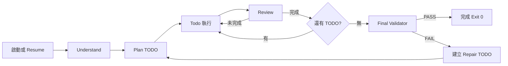
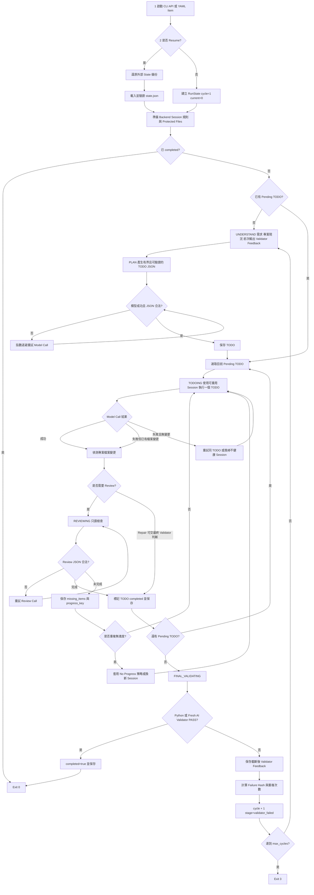
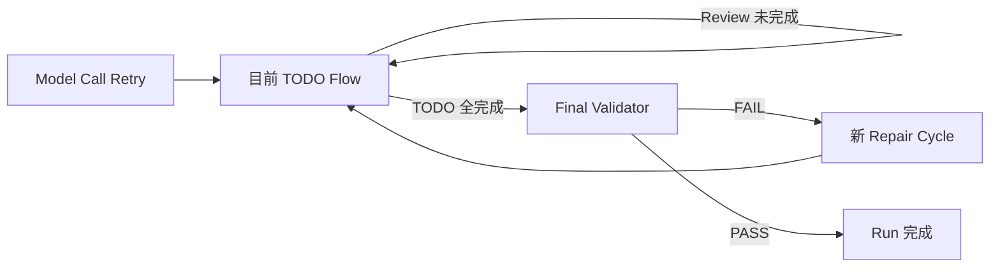

# AI Task Runner 設計文件 v1.1.1

## 1. 設計目的

AI Task Runner 是包在 Qwen Code、OpenCode 等 coding-agent CLI 外層的通用流程控制器。Agent 負責理解與修改專案；Runner 負責流程、狀態、重試、Review、驗證、保護與 Resume。

Runner 不在 Python 內 hardcode 特定專案知識。整個執行只有一個最終完成條件：**Final Validator 必須 PASS**。模型自己說完成、單一 TODO 完成或 Review 通過，都不代表整個 Run 完成。

## 2. 完整流程

### 2.1 簡單版

```text
啟動或 Resume
  -> Understand：理解專案、需求、目前狀態與前次驗證錯誤
  -> Plan：拆成可驗證 TODO
  -> Todo：一次只執行目前 TODO
  -> Review：只讀檢查目前檔案結果
       -> 未完成：重試同一 TODO
       -> 完成：標記完成，切到下一個 TODO
  -> 全部 TODO 完成
  -> Final Validator：執行 Python Validator 或獨立 AI Validator
       -> PASS：completed=true，Exit 0
       -> FAIL：建立 Repair TODO、cycle + 1，再跑下一輪
```



### 2.2 一整條 Stage 順序

正常完成路徑：

```text
startup
-> state_restore 或 state_create
-> backend_prepare
-> understanding
-> planning
-> todoing
-> reviewing
-> todo_completed
-> 下一個 todoing / reviewing
-> final_validating
-> completed
```

Validator 失敗後：

```text
final_validating
-> validator_failed
-> cycle + 1
-> repair_understanding
-> repair_planning
-> repair_todoing
-> reviewing 或交由 validator 最終判定
-> final_validating
-> completed 或再進下一個 repair cycle
```

### 2.3 詳細版



## 3. 三層 Retry

| Retry 層級 | 觸發條件 | 重跑內容 | Session / State 行為 | 停止條件 |
|---|---|---|---|---|
| Model Call Retry | CLI 錯誤、Timeout、Loop Detection、Session unavailable、JSON 不合法 | 單次 planning、todo、review 或 AI validation call | 指數退避；不健康 Session 可更換 | Call 成功或交由上層流程處理 |
| TODO Retry | Review 判定未完成、沒有有效進度、Protected Files 被改、可恢復錯誤 | 同一個目前 TODO | attempts、last_output、progress_key、stagnant_attempts 會保存 | TODO 完成／延後給 Validator，或 max_attempts Exit 2 |
| Validator Cycle Retry | 最終 Validator FAIL | 新一輪 repair understand、plan、todo | 保存 Validator Feedback；相同錯誤重複可換 Session | Validator PASS，或 max_cycles Exit 3 |



## 4. Understand 與 Plan

`Understand` 是邏輯階段，會綜合原始 goal、專案結構、現有檔案、前次 Task 輸出、Validator Feedback 與 Resume State。實作上可能整合在 planning prompt 中，不一定是一個獨立 Python 函式，但流程與 Log 應把它視為獨立概念。

`Plan` is read-only and converts the model understanding into bounded TODO records with title, description, and acceptance_criteria. If planning does not return valid JSON, the runner retries with compact feedback until the fixed task schema is returned. Python does not split user prompts by Markdown, numbering, paragraphs, punctuation, or language-specific keywords.

## 5. Runner 與 Agent 責任

Agent 負責讀取專案、規劃、修改檔案、修復錯誤、只讀 Review 與 AI Final Validation。Runner 負責 CLI/API/YAML 入口、Stage 轉換、Task Index、Retry、Session Reset、Protected Files、Timeout、Watchdog、State Persistence、Resume、Validator、Log 與 Exit Code。

Runner 必須保持 task-agnostic，不得針對特定 App、FAB、Workflow、檔名、演算法或 Validator hardcode。

## 6. 主要入口與模組

```text
ai_task_runner.py -> CLI
runner/api.py -> Python API
runner/script_runner.py -> YAML Batch
runner/core.py -> TaskRunner.run() 主狀態機
runner/validation.py -> Fresh AI Final Validator
runner/support.py -> Retry / Parsing / Protection / Fingerprint
runner/process_control.py -> Timeout / Watchdog / Process Tree Kill
runner/backends/qwen.py -> Qwen Backend
runner/backends/opencode.py -> OpenCode Backend
```

所有入口最後都進入相同 `TaskRunner`，避免 CLI、API、YAML 各自有不同流程。

## 7. State 與 Resume

主要 State：

```text
<project-root>/.ai-task-runner/state.json
```

另外在系統暫存目錄保存一份外部備份。`--resume` 時會優先嘗試還原有效備份，再驗證 state 是否屬於相同 project root。

重要欄位包括 run_id、goal、cycle、current、tasks、validator_output、completed、agent_session_id、stage、last_error、validator_failure_key、validator_failure_count。每個 Task 保存 status、attempts、last_output、last_review、progress_key 與 stagnant_attempts。

State 在每個重要轉換後原子寫入，使用暫存檔加 `os.replace`，並針對 Windows 短暫鎖檔做短重試。

## 8. Todo Execution 與 Review

Runner 一次只執行一個 TODO。Execution 模型即使以 Loop Detection、Timeout 或非零 Exit 結束，只要專案已產生有效變更，Runner 不會直接丟棄成果，而會偵測檔案狀態並進入 Review 或 Final Validator 判斷。

Review 是只讀操作。若 Review 修改 Protected Files，Runner 會還原。Review 必須輸出結構化結果；不合法 JSON 會重試。若有 Python Validator，特定 Review 無法可靠判斷時可把完成判定延後給 Final Validator，避免模型一直重複相同 TODO。

## 9. No Progress 與 Session Reset

每次未完成 Review 會依專案 Fingerprint 與 missing_items 產生 `progress_key`。相同 key 連續出現代表沒有進度，`stagnant_attempts` 會增加。達門檻後 Runner 會加入 no-progress 指示、要求採取不同策略，必要時建立新 Session。

相同 Validator Failure 也會正規化後 Hash。連續重複代表目前 Session 可能被錯誤上下文綁住，因此 Repair Cycle 可切換 Fresh Session，但仍保留 State 與 Validator Feedback。

## 10. Validator

Python Validator 以子行程執行：

```text
python validator.py --project-root <root> --state-file <root>/.ai-task-runner/state.json
```

Exit 0 為 PASS，非零為 FAIL。AI Validator 則必須使用獨立 Fresh Session，避免執行 Agent 自我審查。Validator Feedback 會限制大小並保留頭尾，再轉成 Repair TODO。

## 11. Timeout、Watchdog 與 Process Kill

每個 Agent Call 有 Hard Timeout。Execution 還有 Idle Watchdog；CLI 有輸出或專案檔案有變更都算 Activity。長時間沒有 Activity 時，Runner 終止整個 Process Tree，保存現況，再由 Review／Validator 判斷已落盤成果。

## 12. Protected Files

Runner State、Runner 本身、Validator、QWEN.md、AGENTS.md 等控制檔屬於 Protected Files。Planning、Review、AI Validation 必須只讀。若 Agent 修改 Protected Files，Runner 從 Snapshot 還原，並把事件記錄到 Log。

## 13. YAML Batch

YAML 每個 Item 是獨立 Child Run，State 位於：

```text
.ai-task-runner/script/001/state.json
.ai-task-runner/script/002/state.json
```

Batch 遇到第一個非零 Exit Code 停止。使用相同 YAML 加 `--resume` 時，已完成 Item 跳過，未完成 Item 從其 State 接續。

## 14. Exit Code

| Code | 意義 |
|---|---|
| 0 | Final Validator PASS |
| 2 | 同一 TODO 達 max_attempts |
| 3 | Validator Repair 達 max_cycles |
| 其他非零 | CLI、設定、State 或不可恢復錯誤 |

`max_attempts=0` 與 `max_cycles=0` 表示不設上限，適合 24 小時持續執行；實際仍受外部 OS、電源與程序存活條件限制。

## Review error tolerance

`--review-error-retries N` 只控制 Review 呼叫／格式異常。每次 Review 都使用全新獨立 session，錯誤次數會持久化累積。Review PASS 完成 TODO；明確 Review FAIL 一定把 `missing_items` 交回同一 TODO。預設模式達 N 次連續錯誤且本 TODO 曾有累積檔案變更時，可暫時跳過並交給 Final Validator；`--strict-review` 禁止跳過。


## Final AI 多次獨立驗證

Final AI 可透過 `--final-ai-validations N` 與 `--final-ai-required-passes M` 設定。每一次驗證都建立全新 session，直接重新檢查目前專案。PASS 累積票數；AI 呼叫或 JSON 異常視為棄權；任何具體 FAIL 都會立即否決並進入 Repair Planning。Final AI 除了原始需求，也檢查具有具體證據的重大安全、破壞性、可靠性、可攜性與回歸問題。

### Executor 上下文邊界

Planning 與 Final AI 取得完整 Goal。Planning 先由 Draft Planner 產生草稿，再由全新 Refiner 重寫，接著交給另一個無工具的 Plan Judge 做語意品質判定。Judge 不依標題關鍵字，而是檢查每個 TODO 是否只有一個具體可驗證 deliverable、是否含流程型或尚未發生的推測工作。若拒絕，issues 會交給另一個全新 Refiner 重寫並再 Judge 一次；兩輪仍拒絕才重啟完整 Planning。只有 Judge 接受的 TODO 會保存；初始規劃仍至少 6 項且不固定成 8 項。Executor 只取得目前 Task、共通限制摘要、近期診斷與相關 Validator feedback。同一 TODO 的 changed files 會跨 attempt 累積；Review 使用全新唯讀 session，優先檢查這些 changed files。
