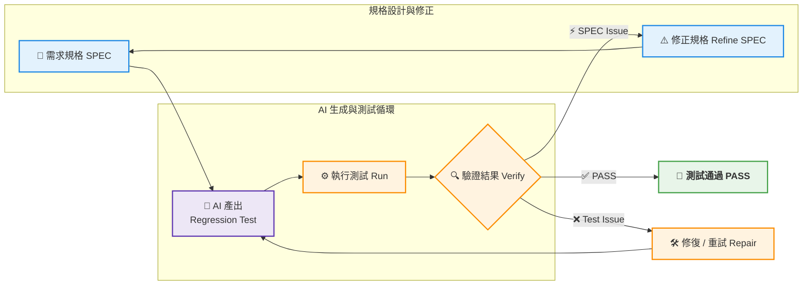
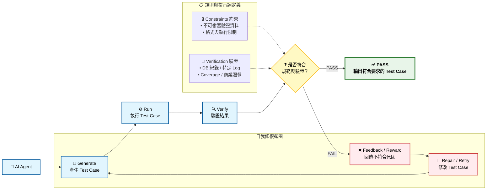
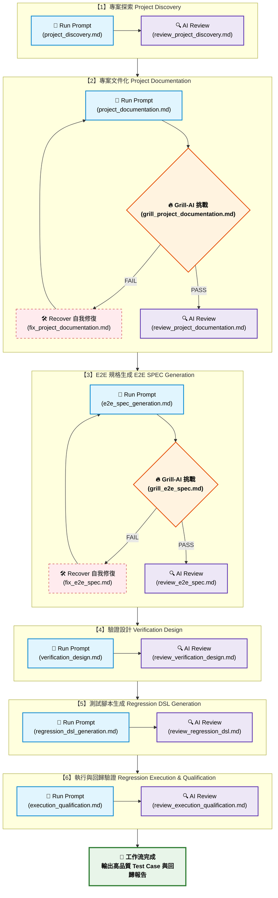

# Regression Test Framework 演進

## Stage 1：降低 Regression Test 重工

Regression Test 很耗時，但不可或缺。但目前每個專案都需要重新建立 Regression Test 與 Mock 機制，容易造成大量重工。

因此建立 Regression Test Framework，希望把共通能力抽出來。

目標是：

**任何專案只要提供一個 E2E Sample，再透過 Skill 讓 AI 延伸產生其他 Test Case。**

目前使用 6 個 Skills 完成這項任務。

---

## Stage 1 的問題：AI 不夠穩定

即使有 **Regression Test Framework + AI**，實際使用仍有幾個問題：

1. 小模型如何產生正確的 Test Case
2. 如何穩定執行長時間任務
3. 如何降低人工介入

例如：

- API 異常需要等待
- Agent 異常導致流程中斷
- 任務常需要多輪對話才能完成

小模型很難一次做到位。

所以可以把問題變成：

**既然不能一次完成，能不能讓 AI 持續執行、驗證、修正，直到符合要求？**

### 方案 1：修改 Agent Source Code

直接修改 Agent 本身可以控制行為，但需要考慮：

- 社群版本持續更新
- 相容性問題
- 後續維護成本

### 方案 2：使用 Agent 內建 Loop

例如 `/goal`、`/ralph-loop` 等機制。

這些方法確實有幫助，但如果希望長時間穩定執行，且結果持續接近預期，仍有一定難度。

### 方案 3：Workflow Loop

相比直接修改 Agent Source Code，或依賴 `/goal`、`/ralph-loop` 等 Agent 內建機制，我們選擇在 Agent 外層建立 Workflow Controller。

核心概念：

**Agent 負責執行，Workflow 負責控制。**

Workflow 統一負責：

- Retry / Recovery
- Session 管理
- 異常監控
- 檔案 / Git 保護
- 驗證與修正

因此底層可以替換 Qwen、OpenCode、Codex 等不同 Agent。

目標不是讓 Agent 永遠不出錯，而是讓 Regression Test 生成具備：

**長時間、低人工介入、可恢復的執行能力。**

---

# Stage 2：從產生 Test Case 轉向驗證結果

Stage 1 解決了：

**AI 怎麼持續工作。**

但還有另一個更根本的問題：

## AI 如何更自動地產生 Regression Test？

傳統做法通常是：

**SPEC → AI Generate Regression Test → Run → Verify → Repair / Retry → Iterate → PASS**



這個流程看起來很合理。

但真正困難的地方在於：

**要事先完整列出所有 SPEC 與 Regression Test，本身就非常困難。**

也就是說，如果我們還是要求：

> 先想清楚所有 Test Case，再交給 AI 實作

那其實只是把最困難的問題留給人。

---

這就像數學遇到原問題難以直接求解時，會把問題轉換成另一個更容易處理的形式。

因此，我們把問題從：

**「AI 應該產生哪些 Test Case？」**

轉換成：

**「在明確的約束條件與驗證規則下，讓 AI 自己找到符合要求的 Test Case。」**

換句話說，我們不一定要先知道完整答案。

我們可以先知道：

**什麼樣的答案是對的。**

實際做法是先定義 **Constraint + Verification / Reward**，再讓 AI 根據 **SPEC、程式碼與 Material**，自主產生、執行、驗證並修正 Test Case。

---

這個概念很像強化學習：

**不是直接告訴 Agent 正確答案，而是定義 Environment、Constraint 與 Reward，讓 Agent 透過反覆嘗試與 Feedback，逐步找到符合目標的解法。**



這裡的重點不是要真的做 Reinforcement Learning。

而是借用它的想法：

**我們不用直接告訴 AI 答案，而是告訴 AI「成功的條件」。**

---

### Example 1

```text
Prepare

Insert SQL

Main

Run EXE

Verify

1. Regression Framework 驗證結果
   - DB 是否有預期紀錄
   - 是否產生特定 Log (Optional)

2. 驗證 Test Case 可信度
   - 不允許偷塞驗證資料
   - 不允許繞過真正流程

3. Code Coverage Rate 符合要求
```

### Example 2

```text
Prepare

Insert SQL

Main

Trigger API

Verify

1. Regression Framework 驗證結果
   - DB 是否有預期紀錄
   - 是否產生特定 Log (Optional)

2. 驗證 Test Case 可信度
   - 不允許偷塞驗證資料
   - 不允許繞過真正流程

3. Code Coverage Rate 符合要求
```

這兩個 Example 的入口不同。

一個可能是 EXE，一個可能是 API。

但對 Framework 來說，核心其實是一樣的：

**只要最後能用一致的方法判斷「這個 Test Case 是否真的有效」即可。**

---

這又有點像深度學習的黑盒概念：

**我們真正關心的是輸出結果，中間如何找到答案不是最重要的。**

但這裡要再加上一個前提：

**AI 可以自由尋找解法，但不能違反 Constraint。**

也就是說：

我們可以不限制 AI 一定要怎麼寫 Test Case，

但必須限制它：

- 不可以偷塞資料
- 不可以跳過真正流程
- 不可以為了 PASS 而修改被測程式
- 不可以用假的結果騙過 Verification

因此真正的概念不是：

**「過程完全不重要。」**

而是：

**「不需要事先規定解法，但必須定義解法的邊界，以及最後如何驗證。」**

---

核心概念：

**與其窮舉 Test Case，不如先定義驗證方法，讓 AI 自己找到能通過驗證的實作方式。**

甚至可以再換一個角度理解：

> 傳統 Regression Test 是「人先想答案，AI 幫忙實作」。
>
> Stage 2 則是「人先定義遊戲規則與過關條件，AI 自己找答案」。

---

# 最終 Regression Test 架構

整體可以收斂成：

**Discovery ➡️ Documentation ➡️ E2E Spec ➡️ Verification Design ➡️ DSL Generation ➡️ Execution ➡️ RESULT**

其中最重要的改變，是多了：

**Verification Design**

因為它開始把「我要 AI 寫哪些 Test Case」轉換成：

**「我要怎麼判斷一個 Test Case 是不是好的？」**

---

利用 Grill-AI 和 Review，讓 AI 自行評判 SPEC 與結果。



這裡 Grill-AI 與 Review 的角色也不同。

**Grill-AI 比較像挑戰者。**

它不是單純問「完成了嗎」，而是主動找：

- 有沒有盲點？
- 有沒有沒考慮到的 Scenario？
- 這份 SPEC 真的合理嗎？
- 文件是不是只看起來完整？
- 假設是否經得起挑戰？

而 **Review 比較像驗收者**：

- Acceptance Criteria 是否完成？
- Output 是否符合要求？
- 是否能安全進入下一個 Stage？

因此可以簡化成：

**Grill-AI 負責把品質往上推。**

**Review 負責守住完成門檻。**

---

最後，整個 Stage 2 可以濃縮成一句話：

**Regression Framework 定義「什麼叫正確」，AI 負責找到「怎麼做到正確」。**

如果再具象一點：

> **Framework 負責畫出靶心，AI 負責想辦法射中靶心。**

甚至：

> **我們不再替 AI 寫完整考卷答案，而是先定義評分標準，再讓 AI 自己解題。**

這就是 Stage 2 從：

**SPEC-driven Generation**

走向：

**AI-generated SPEC → SPEC-driven Generation → Evaluation-driven Iteration**

也就是三層責任：
AI 依照現有資料自動產生 SPEC
AI 依 SPEC 產生 Regression Test
你主要定義 Evaluation / Verification，讓 AI 自己修正

但這裡有一個很重要的前提：

## AI-generated SPEC 是建立在「強假設」之上

這並不代表：

**任何任務只要給 AI 一個簡單 Prompt，就可以自動產生正確 SPEC。**

AI 能夠自動產生 SPEC，是因為我們假設目前的問題空間具備足夠的可推導資訊。

例如 AI 可以取得：

- 現有 Source Code
- Project Documentation
- Existing E2E Sample
- API / DB / Log / Message 定義
- Regression Framework DSL
- Existing Test Case
- 執行結果與錯誤資訊
- Domain Material
- 前一階段產出的 Project Discovery / Documentation

也就是說：

**AI 不是憑空產生 SPEC，而是從現有系統留下的 Evidence 中推導 SPEC。**

這個差異非常重要。


---

# 延伸應用

雖然這套 Workflow 是從 Regression Test 發展出來，但其核心能力也可以延伸到其他「結果可驗證」的任務。

## Unit Test

**推薦程度：★★★★★**

輸入、輸出、Exception、Boundary、Coverage 都可以明確驗證，因此非常適合。

## PRR Report

**推薦程度：★★★★★**

給定一份人寫的PRR(只需提供一次), 只要能定義格式、必要內容與品質規則，就可以：

**Generate → Validate → Repair**

## Security Report

**推薦程度：★★★★☆**

可透過：

**Multi-Agent → Validate / Score → 去重 → 聯集 → Report**

提高穩定度，但 Security 本身仍存在較多主觀判斷，因此較適合作為輔助。

---

# 核心

整套設計最終仍然服務於 Regression Test：

**從「替每個專案寫大量 Test Case」，逐步演進成「定義驗證條件，讓 AI 自動生成、執行、修正 Regression Test」。**

而它之所以能延伸到其他場景，是因為背後真正抽象出的能力是：

**只要結果可以被明確驗證，就可以交給 Workflow 持續生成、驗證與修正。**